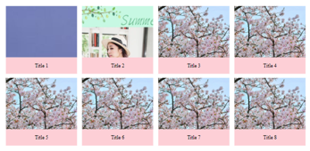
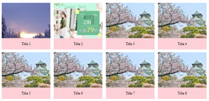
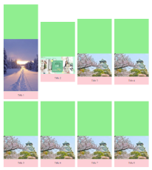
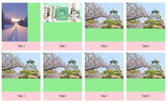
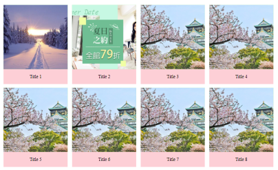

# Assignment01

## Introduction

此專案總共有四個`.html`檔案:

1. index.html
2. Assignment-Week1.html
3. Assignment-Week1_using-backgroundImage.html
4. Assignment-Week1_using-img-objectFit.html

這些檔案的主要差別為：在 RWD 的情況下，不同的圖片呈現方式。

以下簡述檔案之間的差異(以`(1)`、`(2)`、`(3)`、`(4)`來代稱這四個檔案)：

- (1): 為 RWD 排版作業，可略過不看。(p.s. 使用的圖片全部都必須是固定大小，不然排版會跑掉)
- (2): 複製自(1)，替換了前兩張圖片(直、橫)，使用``顯示圖片來呈現排版變化。
- (3): 複製自(1)，替換了前兩張圖片(直、橫)，使用`background-image`屬性顯示圖片，並透過調整`CSS (background-size: cover; height: 給一個固定高度值;)`來呈現排版變化。
- (4): 複製自(1)，替換了前兩張圖片(直、橫)，使用``顯示圖片，並透過調整`CSS (position: relative; object-fit)`來呈現排版變化。

## What happened in (2)、(3)、(4)

接下來各自說明`(2)`、`(3)`、`(4)`的差異。

- (2): 很明顯的，因為沒有對圖片的高度做任何限制，在寬度固定的情況下，圖片會照原本的尺寸顯示，造成排版錯誤。
- (3): 固定了高度後，使用`background-image`屬性顯示圖片，排版沒問題了。

  但是！不同的螢幕寬度，每一張圖片顯示的範圍會不一樣：
  
  因為是使用`background-image`，在拉動螢幕畫面的時候，圖片本身也會跟著裝著圖片的容器一起做縮放。

- (4): 透過將圖片的`
`容器設定成`position: relative;`，並調整圖片的`position: absolute;`，排版沒問題了。而且無論如何拉動螢幕畫面，圖片顯示的範圍都不會變。

## What I do in (3)、(4)

- (3) `background-image`:

  - 將`
`容器設定成使用`background-image`屬性顯示圖片，並給容器一個固定的高度值`height: 固定高度值;`。

    

  - 使用`background-size: cover;`讓圖片填滿容器的寬度及高度。

    

    - 補充
      - `background-size: cover`: 主要用於**背景圖小於所在的內容**，而背景圖又不適合使用 repeat，此時就可以採用 cover 的方式，使背景圖放大至內容的大小，但**此方法容易使背景圖因放大而失真**。

  - 調整背景圖顯示的位置到正中央: `background-position: 50% 50%;`

    

- (4) ``:

  - 將裝著圖片的`
`容器設定成`position: relative;`，用`padding-top`撐開容器。結果如下：

    

    - 補充
      - `position: relative`: 在一個設定為 `position: relative` 的元素內設定 `top` 、 `right` 、 `bottom` 和 `left` 屬性，會使其元素「相對地」調整其原本該出現的所在位置，而不管這些「相對定位」過的元素如何在頁面上移動位置或增加了多少空間，都不會影響到原本其他元素所在的位置。
      - `Padding-top`: Padding-top property in percent **is determined by div width**. So, the child div is getting 100% width of the parent div, and padding top 100% means 100% width of that element. The same applies to margin-top which is calculated by width.

  - 將圖片設定成`position: absolute;`，並將圖片定位在容器的左上角`left: 0; top: 0;`: 這時候會發現圖片被放到容器中了，但是還是沒有填滿空間。

    

    - 補充
      - `position: absolute`: 這個元素被設定成絕對定位(`position: absolute;`)，它會相對於它的父元素進行定位（相對於父元素的絕對定位）。

  - 將圖片加上圖片本身的寬高設定`width: 100%; height: 100%;`，並使用`object-fit: cover;`讓圖片填滿容器的寬度及高度。

    

    - 補充
      - `object-fit:cover`: 填滿元素的寬度及高度(維持原比例)，通常會剪掉部分的物件。如果沒有先設定`width`和`height`，那`object-fit`不會有效果。

## Summary

- 在「固定寬高範圍內，正確顯示圖片」的前提下，不管使用`background-image`或``都可以達成。
- 但是就這份實作而言，會傾向使用``來實作，因為在拉動螢幕畫面的時候，「圖片本身也會跟著裝著圖片的容器一起做縮放」這件事，個人覺得在視覺效果上好像有點違和。
- 不過使用``來實作的話，圖片寬高如果差異太大，將很難看到圖片的全貌，這個部分應該就需要跟設計師討論，盡量固定圖片的尺寸。
