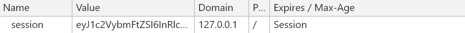
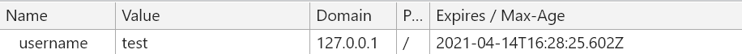
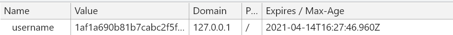

# Assignment04

## Introduction

此專案主要目的為，在會員系統中保存使用者是否登入的狀態。

總共有三個`.py`檔案，使用了兩種保存狀態的方式(`session`和`cookie`):

1. app.py (Using `session`): Flask 內建的 session 是 client side session
2. app_cookie.py (Using `cookie`)
3. app_cookieAndEncrypt.py (Using `cookie` and `MD5`(encrypt))

接下來會討論這兩種保存狀態的方式，之後簡述三個`.py`檔案之間的差異，以及實作的 code。

## cookie v.s. session

- 各家說法
  - cookie 雖然很方便，但是使用 cookie 有一個很大的弊端，cookie 中的所有數據在客戶端就可以被修改，數據非常容易被偽造，那麼一些重要的數據就不能存放在 cookie 中了，而且如果 cookie 中數據字段太多會影響傳輸效率。為了解決這些問題，就產生了 session，session 中的數據是保留在服務器端的。
  - Session 是奠基於 Cookie 之上的功能。
  - Cookie 本來就是為了實作 Session 而生的。
  - Session 機制可以只靠網址列實作，跟 Cookie 可以一點關係都沒有。
  - Cookie 是一張領餐的號碼牌，而 Session 是一張數位會員卡，記錄你的點餐號碼，還可以紀錄你的餐點細節，消費記錄和點餐喜好，解決 Cookie 遺失的問題。
- 到底誰先誰後? 它們之間的關係是?

  - 先定義 Session: Session 有點類似會話的概念，指 client 端跟 server 端之間的對話。
  - 基於這個概念，見下圖：

    

    - 首先，client 端會發送一個 http request 到 server 端。
    - server 端接受 client 端的 request 後，建立一個 session，並發送一個 http response 到 client 端，這個 response 的 header ，其中就包含 Set-Cookie 的 header。該 header 包含了 sessionId。
    - 在 client 端發起的第二次 request ，假如 server 給了 Set-Cookie，瀏覽器會自動在 request header 中添加 cookie
    - server 接收 request ，解析 cookie，驗證信息，核對成功後返回 response 給 client 端

- 總結: 先有 session 這個概念，再使用 cookie 進行 **讓 Request 變成 stateful**的實作。
  | | cookie | session |
  | :------: | ---------------------------------------------------------------------------------------------------------------------------------------------------------- | --------------------------------------------------------------------------------------------------------------------------------------------- |
  | 定義 | 一段由 Server 送給使用者瀏覽器的一小塊資料(文檔)。<br/>瀏覽器會儲存它並且在瀏覽器下一次發送要求的時候將它送回原本送來的伺服器。 | 讓 Request 變成 stateful 的機制。|
  | 作用 | 用來區分兩個要求是來自同一個瀏覽器。<br/> 常用情境: <ul><li>Session management: 用於登入頁、購物車頁面，藉由 Cookie 保留使用者的狀態，來提升使用者流程體驗。</li><li>Tracking: 像是廣告的數據追蹤，就很常需要使用到 Cookie 的功能。</li></ul> | 建立一個 client 端跟 server 端之間的對話|
  | 特色 | <ul><li>特定網域：只針對原本的網域(domain) 起作用</li><li>有生命期限: 到了所設定的生命期限之後會失效。</li></ul>| 為了避免資料被竄改，有兩種解決方式:<ul><li>Cookie-based session: 照舊把狀態存在 Cookie，但是加密以後再存</li><li>把狀態存在 Server 端，靠一個 SessionID 來辨識(這個狀態可以存成 快取、記憶體或資料庫)</li></ul>|
  | 保存在哪 | Client 端: 使用者的電腦裡(因為它是一個檔案)。<br/>可透過瀏覽器來檢測這個設定值是否儲存。 |根據上方「特色」欄位，有兩種方式: <ul><li>Client 端 (`Client Side Session`): 是一種 Cookie-based session，存在 Cookie 裡</li><li>Server 端 (`Server Side Session`): 使用 SessionID，存在 快取(`Cache`)、記憶體(`Memory`, `RAM`)或資料庫(`Database`) </li></ul>|
  | 缺點 | <ul><li>cookie 中的所有數據在 Client 端就可以被修改(重要的數據不能存放在 cookie)</li><li>cookie 中數據字段太多會影響傳輸效率(The official maximum cookie size is 4KB)</li></ul>| - |

- 補充
  - 常見的錯誤認知是一定要有 Cookie 才能實作 Session，這是錯誤的。(因為 session 也可以透過網址列實作)
  - 普遍認知的 session 是指**使用 SessionID**的方式 (存在 server 端)。
  - `Server Side Session` v.s. `Client Side Session`:
    - `Server Side Session`: 在 Cookie 僅存一個 Session_id，而當使用者發送請求時，Server 會根據這個 Session_id 再去資料庫撈取使用者相關資料，來判斷之前儲存的狀態資訊
      - 儲存位置比較(`Cookie` v.s. `Cache` v.s. `Database`): [(ref)](https://medium.com/@renhades/%E7%B0%A1%E5%96%AE%E8%AA%AA-cache-session-cache-4de6f3c77aa1)
        - 存到 Cookie 是最簡單的，不需要任何額外的操作，但要能容忍幾個缺點：
          1. Cookie 最多只能存 4k Data
          2. 每次發請求都會夾帶 Cookie，會影響訪問網站的速度
          3. 可能儲存一些不安全的數據到 Cookie
        - 存到 Cache：
          1. 舊的數據可能被刪除
          2. Session 會很佔 Memory
          3. 如果想要重新設置 Cache（e.g. 系統升級），所有人的 Session 可能失效
        - 存到 Database：
          1. Session 需要手動清理
          2. 如果存在 Redis，必須要有夠大的 Memory，不然一下就滿了
          3. 惡意攻擊可能會儲存大量的無意義 Data
      - 推薦 `Cache` > `Database`，會這樣推薦的理由為：**Session 只是臨時的 Data**
        - 這些記住資訊的方式，不會永遠都存在，是會過期(Expired)跟淘汰的，否則資訊越記越多，可是很浪費資源的！
        - 有許多的工具可以快速實現這些機制的，以 Web Cache Server 來說，Rails 常使用 Redis 與 Memcached。
    - `Client Side Session`: 將 Session 資料加密後，儲存於 Cookie，並沒有再由資料庫再去做撈取的方式，這種專業術語叫做 Client Side Session。
- 推薦閱讀
  - [白話 Session 與 Cookie：從經營雜貨店開始](https://hulitw.medium.com/session-and-cookie-15e47ed838bc)
  - [彻底弄懂 session，cookie，token](https://segmentfault.com/a/1190000017831088)
  - [[Flask 教學] Flask Session 使用方法和介紹](https://www.maxlist.xyz/2019/06/29/flask-session/)
  - [Cookie / Session / Cache 簡單說. 在多個請求中，記住同樣的資訊](https://medium.com/@renhades/%E7%B0%A1%E5%96%AE%E8%AA%AA-cache-session-cache-4de6f3c77aa1)

### 為什麼要有 cookie?

- **Ans**: 因為 Http 無狀態的特性。(畢竟我們想要能夠保存使用者是否登入的狀態的功能)
  - 演變過程: 因為 Http 無狀態的特性 -> 出現了 Session 來補足無狀態性 -> 為了讓 Session ( 具有狀態的一段時間 ) 更容易實現 -> 出現了 Cookie 將 Session Imformation 保存在 Cookie 內。

## Code

- make_response v.s. Response : https://stackoverflow.com/questions/40217464/flask-response-vs-flask-make-response

### app.py (Flask 內建的 session)

```python
app.secret_key = "123" # session 加密的密鑰

@app.route("/member")
def member():
    name = session.get("username")  # 取session裡，key對應的value值
    if name:
        return render_template("member.html")
    else:
        return redirect("/")

@app.route("/signin", methods=["POST"])
def signin():
    username = request.form["username"]
    password = request.form["password"]
    if username == "test" and password == "test":
        session["username"] = "test" # 在登入時，若驗證通過，則把value(帳號: "test")存進key(此為"username")裡面
        return redirect("/member")
    else:
        return redirect("/error")

@app.route("/signout")
def signout():
    session["username"] = False # 登出時，把 value 設成 False。也可以用另一種常用寫法: session.pop("username")
    return redirect("/")
```

- cookie 如下
  

### app_cookie.py (Using cookie)

```python
@app.route("/member")
def member():
    name = request.cookies.get("username") # 取cookie裡，key對應的value值
    if name:
        return render_template("member.html")
    else:
        return redirect("/")


@app.route("/signin", methods=["POST"])
def signin():
    username = request.form["username"]
    password = request.form["password"]
    if username == "test" and password == "test":
        resp = make_response(redirect("/member")) # 在登入時，若驗證通過，則先建立一個 resp (回應) 物件
        resp.set_cookie(key="username", value=username, expires=time.time() + 1 * 60) # 設置 cookie，要設定 key 和 value 值，expires代表有效時間
        return resp
    else:
        return redirect("/error")


@app.route("/signout")
def signout():
    resp = make_response(redirect("/")) # 先建立一個 resp (回應) 物件
    resp.set_cookie(key="username", value="", expires=0) # 登出時，把 expires = 0，就會自動刪除cookie。(不需要把 value 設成空字串，這邊會這樣做只是個人習慣)
    return resp
```

- cookie 如下，可以看到有"有效時間"
  

### app_cookieAndEncrypt.py (Using cookie and MD5(encrypt))

這個加密版本是 app_cookie.py 的延伸，是在登入階段做完身分驗證後，對 set_cookie 的 value 做加密處理。

```python
import hashlib

@app.route("/signin", methods=["POST"])
def signin():
    username = request.form["username"]
    password = request.form["password"]
    if username == "test" and password == "test":
        resp = make_response(redirect("/member"))

        #  do encrypt
        m = hashlib.md5()  # 建立 MD5 物件
        data = "%s-%s" % (username, password)  # 要計算 MD5 雜湊值的資料
        m.update(data.encode("utf-8"))  # 先將資料編碼，再更新 MD5 雜湊值
        h = m.hexdigest()  # 取得 MD5 雜湊值

        resp.set_cookie(key="username", value=h, expires=time.time() + 1 * 60)
        return resp
    else:
        return redirect("/error")
```

- cookie 如下
  
- 參考資料:
  - [Python 計算 MD5 與 SHA 雜湊教學與範例](https://blog.gtwang.org/programming/python-md5-sha-hash-functions-tutorial-examples/)
  - [Flask 笔记-使用 Cookie 及简单加密判断是否为登录用户](https://blog.csdn.net/qq78442761/article/details/104669426)

## Summary

- cookie 或 session 在實作的方面很相似，但從概念上來說，cookie 的概念相對單純，session 則是有不少細節需要釐清(特別是 server side session 和 client side session)。
- Flask 的 session 功能會對 value 做加密，但 cookie 沒有。

  - 關於 Flask 的 session 如何進行加密: session 通過密鑰對數據進行簽名以加密數據，因此，我們得先設置一個密鑰。這裡的密鑰就是一個具有復雜度和隨機性的字符串。可以通過 `flask.secret_key` 屬性或配置變量 `SECRET_KEY` 進行設置。如：`app.secret_key = ‘secret string’`。 更安全的做法是將密鑰寫進**系統環境變量**(在 command line 中用 export 或 set 命令)，或者保存在.env 文件中：`SECRET_KEY = secret string`
    - 參考資料: [flask（五）：cookie 和 session](https://blog.csdn.net/kongsuhongbaby/article/details/101391022)

### 補充

- 關於加密可以看這篇: [[資訊安全] 密碼存明碼，怎麼不直接去裸奔算了？淺談 Hash , 用雜湊保護密碼](https://medium.com/@brad61517/%E8%B3%87%E8%A8%8A%E5%AE%89%E5%85%A8-%E5%AF%86%E7%A2%BC%E5%AD%98%E6%98%8E%E7%A2%BC-%E6%80%8E%E9%BA%BC%E4%B8%8D%E7%9B%B4%E6%8E%A5%E5%8E%BB%E8%A3%B8%E5%A5%94%E7%AE%97%E4%BA%86-%E6%B7%BA%E8%AB%87-hash-%E7%94%A8%E9%9B%9C%E6%B9%8A%E4%BF%9D%E8%AD%B7%E5%AF%86%E7%A2%BC-d561ad2a7d84)

- 如果要使用 server side session，可以使用 Flask-Session 套件:
  - 參考資料: [Server-Side Sessions in Flask with Flask-Session](https://www.youtube.com/watch?v=lvKjQhQ8Fwk&ab_channel=PrettyPrinted)
