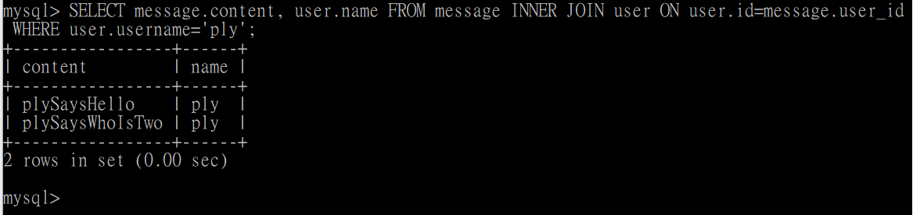

# Assignment05

## requirement 2

- 新增資料庫(命名: website):

  ```
  CREATE DATABASE website;
  ```

- 選擇剛建立的資料庫:
  ```
  use website;
  ```
- 建立資料表(table):

  ```
  CREATE TABLE user ( # 新增產品資料表
  id bigint(20) NOT NULL AUTO_INCREMENT, # 獨立編號
  name varchar(255) NOT NULL, # 姓名
  username varchar(255) NOT NULL, # 帳戶姓名
  password varchar(255) NOT NULL, # 帳戶密碼
  time datetime NOT NULL DEFAULT CURRENT_TIMESTAMP, # 註冊時間
  PRIMARY KEY(id) # 主要索引
  );
  ```

  - 說明:
    - mysql bigint(20)中 20 指的是該字段下能輸入的最大數字長度。
    - 時間: 自動初始化 & 自動更新
      - 自動初始化(建立時, 自動寫入時間): DEFAULT CURRENT_TIMESTAMP
      - 自動更新(更新時, 自動寫入時間): ON UPDATE CURRENT_TIMESTAMP

## requirement 3: 基本的 SQL 指令

- 使用 INSERT 指令新增一筆資料到 user 資料表中，這筆資料的 username 和 password 欄位必須是 ply。接著繼續新增至少 4 筆隨意的資料。

  ```
  INSERT INTO user (name, username, password) VALUES ('ply', 'ply', 'ply');
  INSERT INTO user (name, username, password) VALUES ('two', 'usertwo', 'pwdtwo');
  INSERT INTO user (name, username, password) VALUES ('three', 'userthree', 'pwdthree');
  INSERT INTO user (name, username, password) VALUES ('four', 'userfour', 'pwdfour');
  INSERT INTO user (name, username, password) VALUES ('five', 'userfive', 'pwdfive');
  ```

  

- 使用 SELECT 指令取得所有在 user 資料表中的使用者資料:
  ```
  SELECT * FROM user;
  ```
  
- 使用 SELECT 指令取得 user 資料表中總共有幾筆資料:

  ```
  SELECT COUNT(id) FROM user;
  ```

  

- 使用 SELECT 指令取得所有在 user 資料表中的使用者資料，並按照 time 欄位，由近到遠排序。

  ```
  SELECT * FROM user
  ORDER BY time DESC;
  ```

  

- 使用 SELECT 指令取得 user 資料表中第 2 ~ 4 共三筆資料，並按照 time 欄位，由近到遠排序。

  ```
  SELECT * FROM user
  ORDER BY time DESC
  LIMIT 1,3;
  ```

  

- 使用 SELECT 指令取得欄位 username 是 ply 的使用者資料。

  ```
  SELECT * FROM user
  WHERE username='ply';
  ```

  

- 使用 SELECT 指令取得欄位 username 是 ply、且欄位 password 也是 ply 的資料。

  ```
  SELECT * FROM user
  WHERE username='ply' AND password='ply';
  ```

  

- 使用 UPDATE 指令更新欄位 username 是 ply 的使用者資料，將資料中的 name 欄位改成【丁滿】。

  ```
  UPDATE user
  SET name = '丁滿'
  WHERE username = 'ply';
  ```

  並檢查資料確定有變更

  ```
  SELECT * FROM user;
  ```

  

- 使用 DELETE 指令刪除所有在 user 資料表中的資料。

  ```
  DELETE FROM user;
  ```

  並檢查資料表確定為空

  ```
  SELECT * FROM user;
  ```

  

## requirement 4: 結合資料表 SQL JOIN 的操作

在資料庫中，建立新資料表，取名字為 message 。資料表中必須包含以下欄位設定：

- 建立資料表(table):

  ```

  CREATE TABLE message ( # 新增留言資料表
  id bigint(20) NOT NULL AUTO_INCREMENT, # 獨立編號
  user_id bigint(20) NOT NULL, # 留言會員編號(外鍵對應 user 資料表中的 id)
  content varchar(255) NOT NULL, # 留言內容
  time datetime NOT NULL DEFAULT CURRENT_TIMESTAMP, # 留言時間
  PRIMARY KEY(id) # 主要索引
  );

  ```

  

- 輸入資料

  ```
  INSERT INTO message (user_id, content) VALUES ('1', 'plySaysHello');
  INSERT INTO message (user_id, content) VALUES ('2', 'twoSaysTwoIsHere');
  INSERT INTO message (user_id, content) VALUES ('3', 'threeSaysNoIAmTwo');
  INSERT INTO message (user_id, content) VALUES ('4', 'fourSaysHi');
  INSERT INTO message (user_id, content) VALUES ('5', 'fiveSaysHi');
  INSERT INTO message (user_id, content) VALUES ('1', 'plySaysWhoIsTwo');
  INSERT INTO message (user_id, content) VALUES ('2', 'twoSaysISaidIAmTwo');
  ```

  

- 使用 SELECT 搭配 JOIN 的語法，取得所有留言，資料中須包含留言會員的姓名。
  ```
  SELECT message.content, user.name
  FROM message
  INNER JOIN user
  ON user.id=message.user_id;
  ```
  
- 使用 SELECT 搭配 JOIN 的語法，取得 user 資料表中欄位 username 是 ply 的所有留言，資料中須包含留言會員的姓名。
  ```
  SELECT message.content, user.name
  FROM message
  INNER JOIN user
  ON user.id=message.user_id
  WHERE user.username='ply';
  ```
  

## Hand in

- 透過 mysqldump 工具，將資料庫中的資料匯出到檔案 data.sql，並繳交此檔案。
  - 前置作業(在系統命令行里執行 mysqldump 命令 & 把 mysql 的 bin 路徑添加到 window 系統的環境變量中):
    - Error Msg: mysqldump ERROR 1064 (42000): You have an error in your SQL syntax
      - [在系统命令行里执行 mysqldump 命令！](https://blog.csdn.net/qq_36923648/article/details/104626496)
    - Error Msg: 無法辨識 'mysqldump' 詞彙是否為 Cmdlet、函數、指令檔或可執行程式的名稱
      - [把 mysql 的 bin 路径添加到 window 系统的环境变量中即可。](https://blog.csdn.net/lhp3000/article/details/102289829)
    - Error Msg: 找不到 mysqldump 命令，但它確實存在於目前的位置。Windows PowerShell 預設並不會從目前的位置載入命令。如果您信任這個命令，請改為輸入 ".\mysqldump"。
      - 原本直接輸入`mysqldump -u root -p website > D:\data.sql;`會跳上述錯誤。
  - 執行 cmd 位置: C:\Program Files\MySQL\MySQL Server 8.0\bin
    ```
    .\mysqldump -u root -p website > D:\data.sql;
    ```
